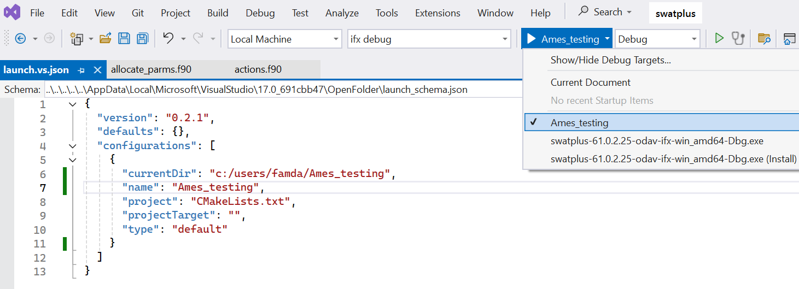

# Developing with Visual Studio on Windows

## Install Required Software

Install the required packages in the order below, this is important! The Intel compiler requires Visual Studio to be installed **first**. Include the  C++ workloads in Visual Studio to add needed support for `cmake`. The Intel installer will provide the `ifx`  compiler. The `ifort` compiler was deprecated in 2024 and removed from the 2025 version going forward. If you download an older version of Intel Fortran, `ifort` will be available. However, SWAT+ produces the same results using both Intel compiler. 

Even though Visual Studio bundles Git, a separate install is needed to support SWAT+ version tagging during the `CMake` build. Install the following, accept the defaults.

1. Install the latest [**Visual Studio Community 2022**](https://visualstudio.microsoft.com/free-developer-offers/), and include the `Desktop Development with C++` workload.

2. Install [**Intel Fortran Compiler for Windows**](https://www.intel.com/content/www/us/en/developer/tools/oneapi/fortran-compiler-download.html) package from Intel, stand alone version.

3. Install [**Git**](https://git-scm.com/downloads/win) .

Running integrated SWAT+ tests in Visual Studio requires Python. You may optionally Install Python from the Microsoft App Store and the Python workload in Visual Studio.    

## Starting Visual Studio

For the SWAT+ build system,  the `CMake` tool is being used, which is integrated in Visual Studio. However, Visual Studio needs to be started the following way for the Intel compiler to work with `CMake` within Visual Studio. Always follow those steps to start Visual Studio!  

1. In your Windows Start Menu, search for `intel...` and select **"Intel oneAPI command prompt for Intel 64 for Visual Studio 2022"**  which will open a terminal window an load needed Intel compiler information. You may pin that menu item.
   
   

2. You will see the terminal opening and then the output below, followed by a command prompt. Intel Fortran is now initialized.
   
   ```cmd
   :: initializing oneAPI environment...
      Initializing Visual Studio command-line environment...
      Visual Studio version 17.13.0 environment configured.
      "C:\Program Files\Microsoft Visual Studio\2022\Community\"
      Visual Studio command-line environment initialized for: 'x64'
   :  compiler -- latest
   :  debugger -- latest
   :  mpi -- latest
   :  umf -- latest
   :: oneAPI environment initialized ::
   
   C:\Program Files (x86)\Intel\oneAPI>_
   ```

3. At the prompt of this terminal type the command `devenv` and press `Enter`. This will start Visual Studio with the proper Intel compiler settings.
   
   ```cmd
   C:\Program Files (x86)\Intel\oneAPI> devenv 
   ```

Note: If you start Visual Studio by just clicking on the icon and skipping step 1.  you won't be able to compile and build SWAT+. 

## Cloning the SWAT+ Repository from GitHub

You can use Visual Studio directly to clone the SWAT+ repository from GitHub and add it as a Visual Studio project. 

1. Select `Clone a Repository` on the Visual Studio 2022 start screen. 
   
   

2. Select the GitHub icon on the left side to browse your repositories. Log into GitHub with your credentials, a list of your available repositories will be shown, select your fork of the `swatplus` repository and press `Open`. Adjust the local path if needed. 
   
   

3. Visual Studio will now clone the repository from GitHub and will load it as a project into the solution explorer as a `CMake` project. It will try to configure the build system to compile the SWAT+ source code with either `gfortran`, `ifort`, or `ifx`. Depending on the presence of each compiler the build configuration will succeed.  Note that the 2025 Intel Fortran compiler will only provide `ifx`, hence the use of `ifort` will fail.
   
   

## Configuring, Compiling, Running, and Debugging SWAT+

**Configuration**. SWAT+ is configured as a `CMake` project. `CMake` is a cross platform build system that allows the creation of the swat executable for all operating systems using various IDEs, compilers and environments such as GitHub. Visual Studio and Visual Studio Code support `CMake` as provided through the `C++ Desktop Development Workload`.

The Repository `CMake` configuration contains settings for various compiler on different operating systems. In Visual Studio, the available compiler and their respective Debug/Release configuration can be selected through the Visual Studio toolbar User interface.


Using the drop-down, compiler configurations can be switched. On selection change the system will recreate the build system and the compiler configuration as shown in the output window. Major `CMake` settings are printed out and can be used to verify the proper compiler setup. 


The build configuration can always be recreated by <kbd>Right</kbd> + <kbd>Click</kbd> on the `CMakeLists.txt` file in the solution explorer and select `Delete Cache and Reconfigure`.

**Compiling.**  SWAT+ can be compiled by selecting the menu item `Build | Build All` or `Build | Rebuild All`. It will compile all Fortran files and link the executable. The name of the executable contains the compiler name, architecture, and version. The version is obtained automatically from the latest tag in GitHub. 


Since SWAT+ it is compiled and linked with the Intel compiler and linker, the SWAT+ executable (for Windows) is dynamically linked. Additional run-time libraries (DLLs) are needed for execution on another machine that does not have Visual Studio installed. ([Intel® C++ and Fortran Compilers Redistributable Libraries by Version](https://www.intel.com/content/www/us/en/developer/articles/tool/compilers-redistributable-libraries-by-version.html)) 

**Running/Debugging.**  The created SWAT+ executable can be tested now. The Visual Studio project needs to be configured with the folder containing a SWAT+ inputs to run. <kbd>Right</kbd> + <kbd>Click</kbd> on the file `CMakeLists.txt` in the solution explorer and select the menu item `Add Debug Configuration`. 


In the next dialog select the `Default` entry in the list of multiple debug configuration options and press the `Select` button. A default Visual Studio launch configuration file `launch.vs.json` gets created if not present in your SWAT+ project setting and will open up for editing. 

```JSON
{
  "version": "0.2.1",
  "defaults": {},
  "configurations": [
    {
      "type": "default",
      "project": "CMakeLists.txt",
      "projectTarget": "",
      "name": "CMakeLists.txt",
    }
  ]
}
```

Here you can add the folder that the SWAT+ executable will run under. Add a new entry `currentDir` as shown below and save the file (<kbd>Ctrl</kbd>+<kbd>S</kbd>). Do not change or delete the `project` or `type`  entry in this file, but you may want to adjust the name to be the same as the `currentDir` folder (see below). The value for `currentDir` can be an absolute path or relative to the root of your `swatplus` project folder. 

As an example, let's assume there is a valid SWAT+ input data set in the folder `C:/work/sp/Ames_testing`. Add the following to your `launch.vs.json`: 

```JSON
{
  "version": "0.2.1",
  "defaults": {},
  "configurations": [
    {
      "type": "default",
      "project": "CMakeLists.txt",
      "projectTarget": "",
      "name": "Ames_testing",
      "currentDir": "C:/work/sp/Ames_testing",
    }
  ]
} 
```

By also changing the configuration name (to `Ames_testing`) you have more descriptive debug target in your toolbar. You can also add additional launch configurations by clicking `Add Debug Configuration` again and add a different `currentPath` for another testing data set.



You can now run or debug the new executable using the `Ames_testing` data set. Make sure that the executable to run in the execution drop-down is set to `Ames_testing`. 

Select the `Debug | Start Debugging` or `Debug | Start Without Debugging` menu item to start model execution in `Ames_testing` and run this data set. 

Start running and debugging, set breakpoints, conditional watches, etc. that help troubleshooting.


## Resources

[Intel® C++ and Fortran Compilers Redistributable Libraries by Version](https://www.intel.com/content/www/us/en/developer/articles/tool/compilers-redistributable-libraries-by-version.html)

[Intel® Fortran Compiler](https://www.intel.com/content/www/us/en/developer/tools/oneapi/fortran-compiler.html#gs.kh30qh)

[Intel® Fortran Compiler for oneAPI Release Notes](https://www.intel.com/content/www/us/en/developer/articles/release-notes/oneapi-fortran-compiler-release-notes.html)

[Visual Studio documentation | Microsoft Learn](https://learn.microsoft.com/en-us/visualstudio/windows/?view=vs-2022&preserve-view=true)

[CMake](https://cmake.org)
