# Visual Studio Code Codespaces Instructions

## Introduction

Swatplus repositories have a `.devcontainer`folder which contains files that enable Github Codespaces to start a virtual Visual Studio Code (VSCode) instance within Github.  

On starting a Codespaces VSCode instance:

- Your repository fork will be loaded into a remote working folder on GitHub.

- The Intel IFX and gfortran compilers will downloaded and installed.

- VSCode will be configured to use the CMAKE build system.

- Necessary VSCode extensions will be loaded to enable debugging Fortran code.  

- A working input data set will be loaded into `/workdata/Ames_sub1` folder.  This data can be replaced by uploading your own input data set.  

- An empty` /workdata/myfolder` will be created.

## Cost of GitHub Codespaces Instances

The first 120 hours within a  month for all Codespace instances are free but after that the user will be charged  to continue to use a VSCode virtual instance.  The 120 hours is total   time of all configured CPUs.  So a 2 CPU instance that is active for 60 hours will equal 120 hours.  There is also a small hourly change for storage of the instance and its data whether  active or inactive virtual instances.  There are four virtual instance states to be aware of, active, inactive, shutdown, and deleted.

**Active:** A virtual instance is active if it is being actively used either by user interaction or by compiling code. After 30 minutes of no activity, the state will change to inactive.  This timeout can be configured.  There is an hourly charge for an active instance in the active state and plus a small hourly storage fee.

**Inactive:**  The virtual instance is inactive if it is not actively being used.  There is not an hourly charge for the instance in the inactive state but there is still a small hourly fee for instance and data storage.

**Shutdown:** The virtual instance can be shutdown by the user.  This forces the instance to go to an inactive state and inactive storage charges will apply. 

**Deleted:**  The virtual instance can be deleted and then no charges for usage or storage will apply.  To start again, the user will need start a new virtual instance.

## How to Start a Codespaces VSCode Virtual Instance

Log into GitHub and navigate to your swatplus repository in GitHub.  

In the upper left corner click on the hamburger (or stacked pizza) icon and then click on   Codespaces.

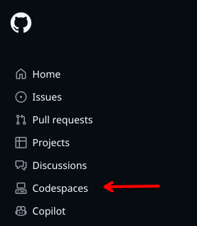

In the upper right click on New Codespace:

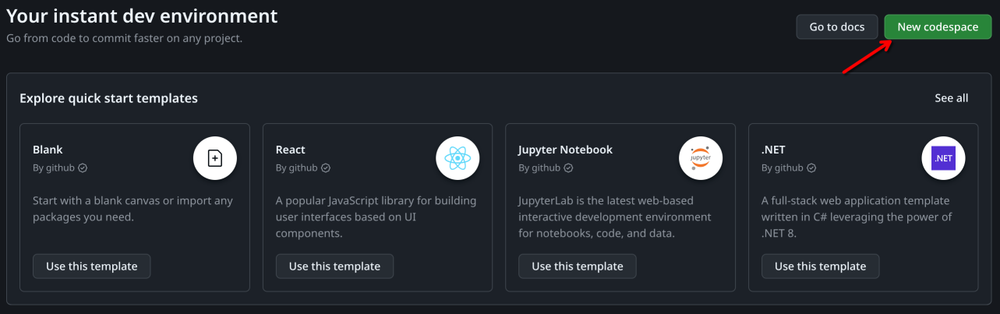

In the drop downs, select the repository and branch then number of CPUs then click on `Create codespace`.  For smaller projects, 2 CPUs is plenty of compute power.  Once your done, it should look something like:

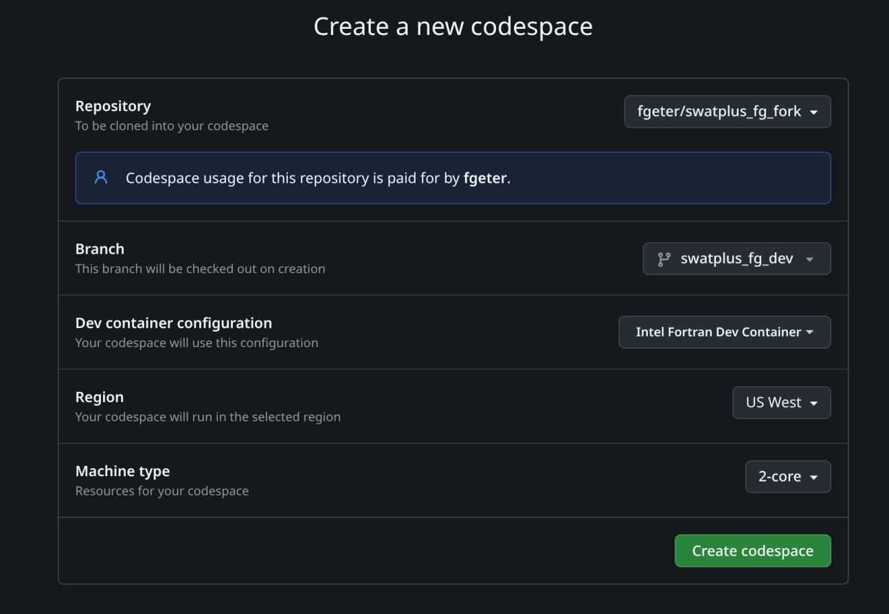

It will take a couple of minutes for the virtual instance to be set up because virtual machines have to be started, software and extensions loaded.  You should see an installation progress bar in the lower right.

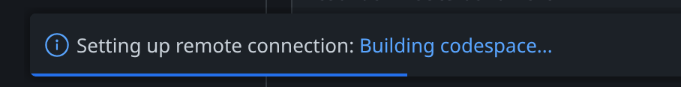

Once that progress bar goes away, you should see a drop down menu in the top center to select the kind of Fortran compiler that you want to use.  Click on the one you want to use.

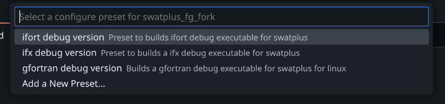

Now you are ready to begin compiling your code.  On the left hand side, click on the triangle with the wrench to bring up the CMAKE window.

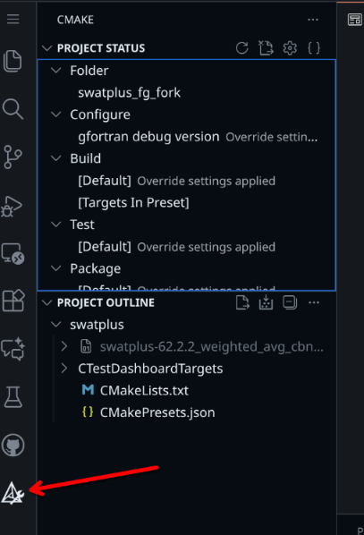

First make sure under `Project Status | Configure` in the CMAKE window that the correct Fortran compiler is displayed.  If not, hover over it and select the pencil icon then select a compiler of your choice.  

Right click on CMakeLists.txt in the CMAKE window and select `Clean and Reconfigure`

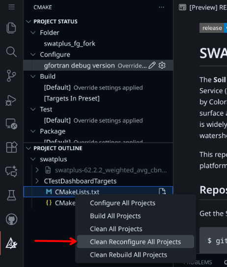

You should always do the above step when you switch from one compiler to another.  In addition, you may need to do the above step if you add or subtract modules or subroutines from your swatplus code.  

Now you're ready to build the code.  Right click on CMakeLists.txt in the CMAKE window and select Build All Projects.

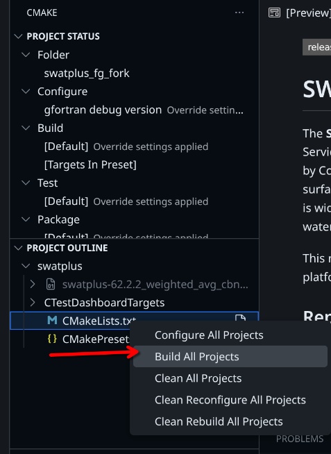

In the output window at the bottom of the VSCode window, you should see the code compiling.   If the compile is successful, it should end with something like:

`[build] Build finished with exit code 0`

Once the compile is complete, the code can be executed by clicking on the icon that looks like triangle pointing to the right with a bug on top of it then selecting the Ames_sub1 in the dropdown menu then click on the green triangle next to the selected input data set.  

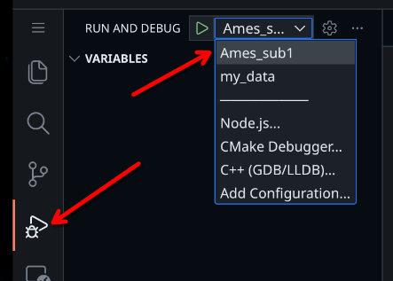

After a fresh build, you may need to select which executable you want to run.  If so, a pop window will appear at the top center of VSCode. Any of the selections should work if you chose a a debug build.  If you chose a release build, you will not be able to debug with that executable.

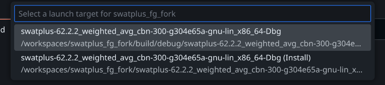

To see the progress of you model run, click on the Terminal tab in bottom window of VSCode.

VSCode in GitHub Codespaces has full debug capabilities.  Regular and conditional breakpoints can be set and if a runtime exception occurs, VSCode will stop at the point of error and the values of variables at the point of failure can be examined in the debugger.   

## How to Run VSCode With Your Own Dataset

You can upload your own input data.   When the virtual VSCode instance was created, two folders were created in the `/workdata` folder,  one called `Ames_sub1` and another folder called `my_data`.    The contents of the `/workdata/Ames_sub1`  folder was copied from the folder `/refdata/Ames_sub1` when the VSCode virtual instance was created and this is the input data set that was run earlier in debug mode.   The `/workdata/my_data` folder is empty.

If you want run swatplus your with own data set, right click on the empty  /workdata/my_data folder in the  VSCode solution explorer and select upload then your local file browser will appear.  You may have to allow cookies to allow permission in GitHub to open your local file explorer.  Once the local file explorer is open, navigate to your local data set and select all the files that you want to upload then select open or upload.  How the local file explorer looks depends on the local operating system that you are using.

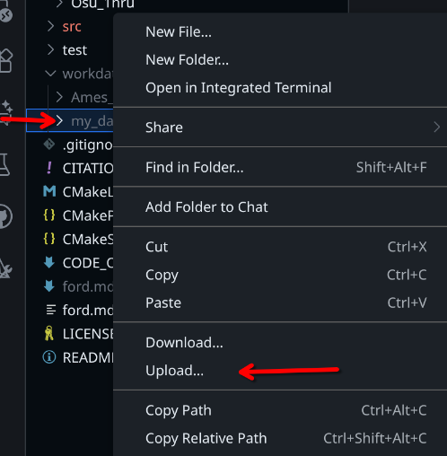

After your input data has been uploaded into the `/workspace/my_data` folder.  Repeat the process of clicking on the debug icon but this time select `my_data` in the in the dropdown menu then the green triangle.

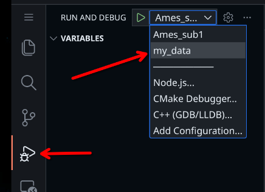

If you want to have multiple input data sets, you can create additional folders as needed in the /workdata folder and then modify the /.vscode/launch.json file.   The default lauch.json file  has two json blocks in the "configurations" section to look for input data sets in /workdata/Ames_sub1 and in /workdata/my_data.  To add another data set, copy one of the current json blocks in "configurations" (i.e. either Ames_sub1 or my_data) to create a new section and then change the "name" variable to the name you want and the "cwd" to point to the input folder of your data."   For example, if you had input data in a folder called /workdata/walnut_creak, the .vscode/launch.json file would be modified to add a json block under at the end in the "configurations" section.  Be sure to add a comma between each section:

```JSON
{
    "version": "0.2.0",
    "configurations": [
        {
            "name": "Ames_sub1",
            "type": "cppdbg",
            "request": "launch",
            // Resolved by CMake Tools:
            "program": "${command:cmake.launchTargetPath}",
            "args": [],
            "stopAtEntry": false,
            // Change the following to where swatplus input data exists
            "cwd": "${workspaceFolder}/workdata/Ames_sub1",
            "environment": [
                {
                    // add the directory where our target was built to the PATHs
                    // it gets resolved by CMake Tools:
                    "name": "PATH",
                    "value": "${env:PATH}:${command:cmake.getLaunchTargetDirectory}"
                }
            ],
            "externalConsole": false,
            "MIMode": "gdb",
            // "preLaunchTask": "CMake: clean rebuild",
            "setupCommands": [
                {
                    "description": "Enable pretty-printing for gdb",
                    "text": "-enable-pretty-printing",
                    "ignoreFailures": true
                }
            ]
        },
        {
            "name": "my_data",
            "type": "cppdbg",
            "request": "launch",
            // Resolved by CMake Tools:
            "program": "${command:cmake.launchTargetPath}",
            "args": [],
            "stopAtEntry": false,
            // Change the following to where swatplus input data exists
            "cwd": "${workspaceFolder}/workdata/my_data",
            "environment": [
                {
                    // add the directory where our target was built to the PATHs
                    // it gets resolved by CMake Tools:
                    "name": "PATH",
                    "value": "${env:PATH}:${command:cmake.getLaunchTargetDirectory}"
                }
            ],
            "externalConsole": false,
            "MIMode": "gdb",
            // "preLaunchTask": "CMake: clean rebuild",
            "setupCommands": [
                {
                    "description": "Enable pretty-printing for gdb",
                    "text": "-enable-pretty-printing",
                    "ignoreFailures": true
                }
            ]
        },
        {
            "name": "walnut_creek",
            "type": "cppdbg",
            "request": "launch",
            // Resolved by CMake Tools:
            "program": "${command:cmake.launchTargetPath}",
            "args": [],
            "stopAtEntry": false,
            // Change the following to where swatplus input data exists
            "cwd": "${workspaceFolder}/workdata/walnut_creek",
            "environment": [
                {
                    // add the directory where our target was built to the PATHs
                    // it gets resolved by CMake Tools:
                    "name": "PATH",
                    "value": "${env:PATH}:${command:cmake.getLaunchTargetDirectory}"
                }
            ],
            "externalConsole": false,
            "MIMode": "gdb",
            // "preLaunchTask": "CMake: clean rebuild",
            "setupCommands": [
                {
                    "description": "Enable pretty-printing for gdb",
                    "text": "-enable-pretty-printing",
                    "ignoreFailures": true
                }
            ]
        }
    ]
}
```

## How To Stop a VSCode Virtual Instance

In order to reduce GitHub charges to your GitHub account, you may want to stop your VSCode virtual instance to prevent charges for active usage.  

To stop the virtual instance from running click on Codespace in the lower left corner of VSCode and then select Stop Current Codespace.  This will take a minute or two to complete.

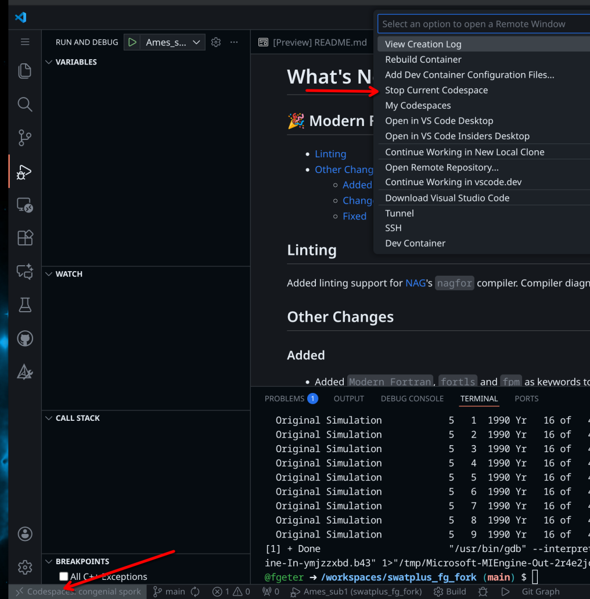

## How to Delete Codespace Instance

In order to delete the VSCode Codespace instance, first stop the Codespace instance as shown above then return the browser tab where you first created the virtual instance and refresh the browser or navigate to your GitHub repository and click on the hambuger icon in the upper left and click on Codespaces.  You should see the the name of your Codespace instance listed at the bottom.   To delete the Codespace instance, click the ellipses to the far right of your Codespace name then click on Delete. 

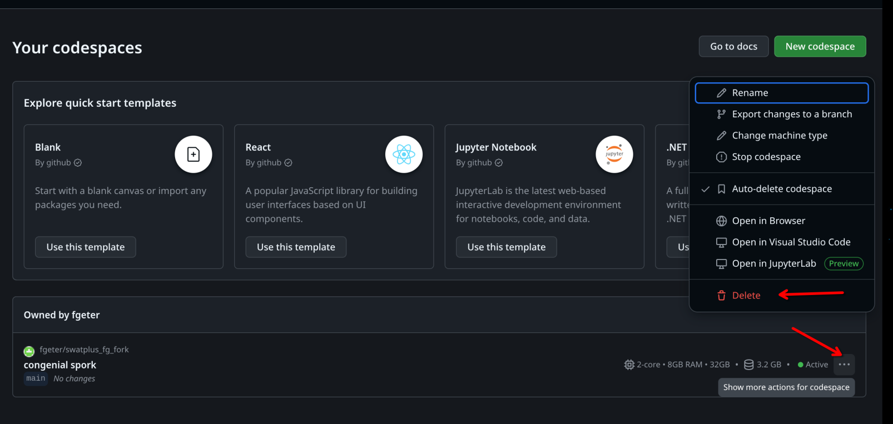
